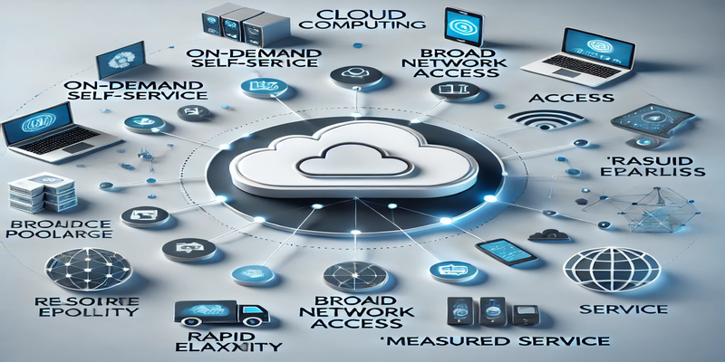
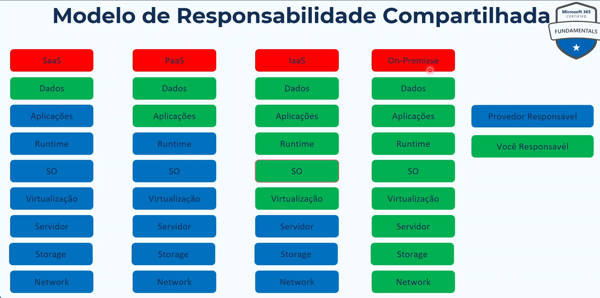

# -Estudos-MS-900
 Estudos MS-900

## Conceitos de computação em nuvem 
### O que é computação em nuvem
Computação em nuvem, ou simplemente "nuvem", refere-se à entrega de serviçõs de computação pela internet(a "nuvem"). Isso inclui uma variedade de recursos, como armazenamento, servidores, banco de dados, redes, software e mais, tudo fornecido de forma remota por provedores de nuvem como Microsoft Azure, AWS(Amazon Web Service) e Google Cloud.

#### Conceitos básicos:
- **On-demand self-service**: Usuários podem acessar recursos de computação sob demanda sem a necessidade de interação humana com o provedor de serviço.
- **Broad network acess**: Os serviço são acessiveis pela rede através de dispositivos padrões, como laptops, smartphones e tablets.
- **Resource pooling**: Provedores de nuvem usam o modelo de multitenant para servir múltiplos clientes, alocando dinamicamente e realocando recursos físicos e virtuais de acordo com a demanda dos clientes.
- **Rapid elasticity**: Capacidade de escalar rapidamente para fora e para dentro conforme necessário. Para o consumidor, os recursos muitas vezes parecem ilimitados e podem ser comprados em qualquer quantidade a qualquer momento.
- **Measured service**: Sistemas de nuvem automaticamente controlam e otimizam o uso de recursos através de uma capacidade de medição, fornecendo transparência tanto para o provedor quanto para o consumidor dos serviços utilizados.

## Tipos de serviços
### Infrastructure as a Service (IaaS):
  - **Descrição**: Fornece infraestrutura virtualizada pela internet. Inclui recursos como servidores, armazenamento e redes.
  - **Exemplos**: Microsoft Azure, Amazon Web Services (AWS) EC2.
  - **Uso Comum**: Hospedagem de sites, desenvolvimento e testes, análise de dados, backup e recuperação.

### Platform as a Service (PaaS):
  - **Descrição**: Fornece uma plataforma e ambiente para desenvolver, testar e gerenciar aplicativos. Inclui infraestrutura e também ferramentas de desenvolvimento.
  - **Exemplos**: Microsoft Azure App Services, Google App Engine.
  - **Uso Comum**: Desenvolvimento e implantação rápida de aplicativos, análise de dados em tempo real, serviços de middleware.

### Software as a Service (SaaS):
  - **Descrição**: Fornece software por meio da internet. Usuários acessam aplicações diretamente pela web, sem necessidade de instalação.
  - **Exemplos**: Microsoft Office 365, Google Workspace.
  - **Uso Comum**: E-mail, gerenciamento de relacionamento com clientes (CRM), aplicativos empresariais e colaboração.

## Responsabilidades

